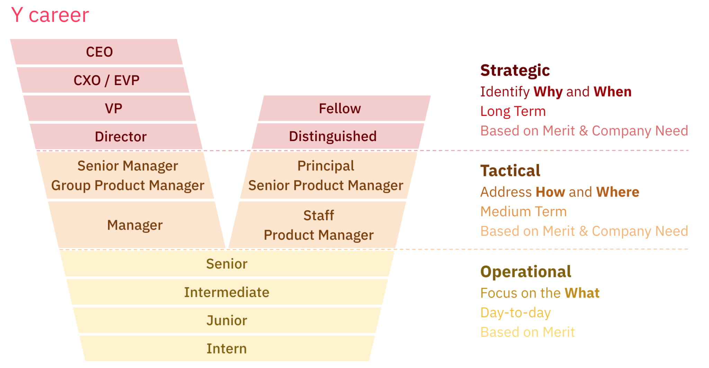
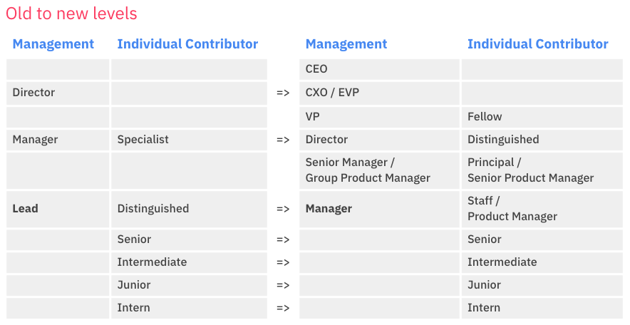

# Career Path

## Intro

The Rocket.Chat's career path considers the long-term relationship development with the team member. This trail goal permits the full development of the team members, weighing their expectations, skills, and company needs.

The paths consider technical and nontechnical aspects based on a “Y” career allowing the team member to tread their career path in a technical or the management trial reaching similar levels, regardless of path chosen by the employee.

## Levels

### 

### Strategic level

This level is in charge of **setting the company’s goals**, provide and approve the resources supply for the other company levels to reach the objectives.

Seniors professionals, as C-Level, Fellows, and Distinguished, form this level. They are part of the company’s executive meeting, and ideally, this level is in charge of a department of the company.

The strategic level has a specific budget typically and has a set of OKRs to be accountable for delivery.

#### Daywork

A strategic level member has to regularly **touch the bases with their managers**, represent the company in external meetings, meet the department in internal meetings, and discuss strategy with their pairs and their working teams.

The strategic level member also **knows the operations** very well and must keep in touch with the other organization’s members.

#### Outcome

The strategy must answer **WHY and WHEN** the company has to reach each goal. **The definitions of Vision, Mission, and Company values** are other important outcomes from the strategic level. This stage offers a long-term view of the company.

It is essential to say that all those concepts mentioned in the last paragraph must be clear, tangible, and intelligible for the other organization’s levels since the strategic level has more information and context than the tactical and operational teams.

### Tactical level

The tactical level is in charge of **transforming the company goals into actions and initiatives**. Middle-level or senior professionals as Principal, Managers, and staff participates in committees and commissions and provide information for the other levels of the organization.

They usually do the **management of the resources of company departments**. The tactical level is in charge of being a bridge between the strategy and the operation.

#### Daywork

The tactical level members **oversee the operation daily**, **move the roadblocks**, and represent the department in meetings. Give guidance for the operational team and measure the efficiency of the ongoing activities. **Map, support, and give maintenance** for the actual business **process**.

#### Outcome

The tactical must answer **HOW and WHERE** the company will reach the goals. The roadmaps and the portfolio are other essential outcomes. The tactical level members are in charge of providing executive information for the strategic level and translating the strategy into actions for the operation. This stage offers a medium-term view of the company. This level must act as a coach, helping to identify how to held the best of each resource.

### Operational Level

The operational level is in charge of **delivering value to the product, client, and user**. The Operational level Is the part of the company that puts the strategy and the tactics ongoing. Formed by Junior, Intermediate, and Senior professionals, the operational team members execute the actions and initiatives defined with the tactical level.

The operational team member can also create a new strategy or tactic initiative helping the organization on another level.

#### Daywork

The operational team member executes the process and **adds value to the products** and services supplied by the organization. In addition, the operational team is **involved in the planning, improvement, and implementation of the strategy and the company’s tactics**.

#### Outcome

The operational team must answer **WHAT** company objectives were reached**.** As the closest client part of the company, the team helps provide feedback that will enable the organization to set new strategies and tactics. The members of this level have to provide operational support and information for the other levels of the organization. This stage offers a Day-to-day view of the company.

## The Rocket.Chat Career Path

Rocket.Chat adopted a model where both technical and management careers can reach the same levels. According to the company beliefs, collaborators can be very skilled technical professionals and be well recognized in roles and salaries.

Adopting the “Y” career path model permits the team member to evolve in the first career steps with a common axis. Then, after deciding, based on the personal objectives and company needs, the development path will be followed.

Once someone reaches a Senior-level role and wants to progress, they will need to decide if they wish to remain purely technical or pursue managing technical teams. Their manager can provide opportunities to try tasks from both tracks if they want to. Staff-level roles and Manager roles are equivalent in terms of base compensation and prestige.

### The common axis

Will be assigned Intern, Junior, Intermediate, and Senior levels to the entry positions according to their experience, skills, and characteristics. In this common axis, there’s no separation between Technical and Management careers.

### The Individual contributor axis

Technical excellence is something that Rocket.Chat values. Individual contributor career path allows the team member to keep their development without considering a change to a management approach and still with similar compensation.

The specific trail also clarifies the requirements for the team member assignment within a particular position.

#### Roles

In the individual contributor path, the team member can reach the following levels:

**At tactical level**

**First stage**

Staff or Product Manager: Considering the career will be directed for a product or technical trail.

The first step of the tactical level is acting as a consultant and an individual reference for the team.

**Second stage**

Principal or Senior Product Manager: Considering the career will be directed for a product or technical trail.

The second step of the tactical level is acting as a high consultant and a corporative reference for the team.

**At strategic level**

**First stage**

Distinguished: At this level, the person's contribution plays to their strength and role on the team. These contributions come in different forms: Provides technical direction to stakeholders \(Product, Sales, others\) and being the primary reference for the company on a specific topic influencing the company’s strategic decisions.

**Second stage**

Fellow: Advocate for improvements, being a principal reference for a specific product, service, or technology. Exert significant influence on the overall objectives and long-range goals. Solve technical problems of the highest scope and complexity for the entire organization.

### The management axis

In the management path, the team member can reach the following levels:

**At tactical level**

**First stage**

Manager: At this level, the managers will seek to build out a great team, happy and prosperous; They will improve processes to make the team more effective. Plan and execute long-term strategies that benefit the team and the product stage**.** In charge of the people management, the manager must hold regular 1:1's with all team members helping the people evolve and grow up as a professional.

**Second stage**

Senior Manager or Group Product Manager: At this level, the person must extend the manager’s responsibilities; Manage multiple teams. Generate and implement process improvements, especially cross-team processes. Regarding people management, this individual must hold regular 1:1s with team managers and skip-level 1:1s with all team members. Establish a management mentorship.

**At strategic level**

**First stage**

Director: At this level, the person must extend the Senior Manager requirements and add excellent communication skills; Expert hiring manager skills. Be the manager of managers and keep solid agile project management skills. This position requires also to be in charge of budgeting and the second level OKR management, overseen the initiatives related.

**Second stage**

VP: At this level, the person must extend that of the Senior Director, Development responsibilities. It expands the role to cover full functional and product capabilities at Rocket.Chat. Drive recruiting of a world-class team at all levels. Help their directors, senior managers, managers, and individual contributors grow their skills and experience.

**Third stage**

C-Level: Be the principal management reference in the department. At this level, the person will be in charge of developing the organization strategy, defining the company’s main objectives, and representing the company for the board of investors. In addition, be a mentor to the company leadership.

## The Reference

Considering the model proposed is replacing the old one, it is essential to mention the reference for keeping the consistency between the old and the new.

It Is important to reinforce that all the positions will receive a grade, and this grade will be the reference to link the old and the new chart.

The grades start at four and go until 16, and it doesn’t depend if the team member is a Manager or an Individual Contributor. An individual contributor can have the same grade as the Manager and consequently the same salary input. It is also must consider that the compensation has others inputs like the region and fee charges.

