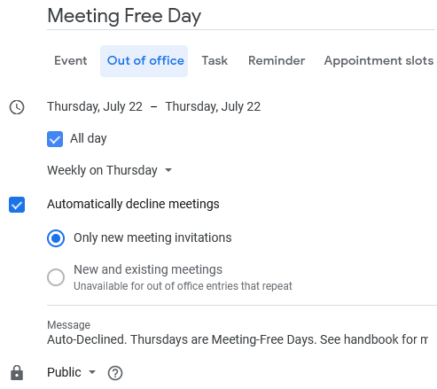

# Blocking Calendar Slots and Meeting Free Day

## **Objective**

We highly encourage you to reserve slots on your calendar and have Thursday as a meeting-free day. This is focused on reducing the context-switching of the day-to-day activities and allows you to focus on critical items.

Please note we trust each Rocketers common sense on making the best use of guidelines presented here.

Having said this, the purpose of this page is to share general guidelines on these calendar slot blockers.

## **General Guidelines**

### **1. Blocking your calendar**

#### **1.1. Out-of-office**

In case you are setting slots of time on your calendar for unavailable periods \(e.g. take kids to school, doctor appointments, etc\) create an event for the given period using the **Out of Office** type of event.

#### **1.2. Focused individual work**

In case you are setting slots of time on your calendar for focused individual work, place an event calendar entry on your agenda starting with the title **Reserved** or **Blocked** and set its duration.

**Blocked** periods should never be used by others unless it's an emergency and no other slot is possible for the situation. When it happens it's important to talk to the person and ask permission to use the blocked slot.

**Reserved** periods can be used for meetings then no other available time is possible to be used, it indicates non-preferable periods for meetings in order to concentrate them in other moments but can be used for **non-recurrent** meetings if necessary \(e.g. recruiting meeting, training session, etc\).

### **2. Meeting-Free Thursdays**

For meeting-free Thursdays set a public **Out of Office** calendar entry for a **full day** starting on any given Thursday.


Please note at this point this is being used only by **Engineering Area**.


You can set it to automatically decline meetings and the automatic message `Auto-Declined. Thursdays are Meeting-Free Days. See handbook for more details: https://go.rocket.chat/i/meeting-free-thursdays`

