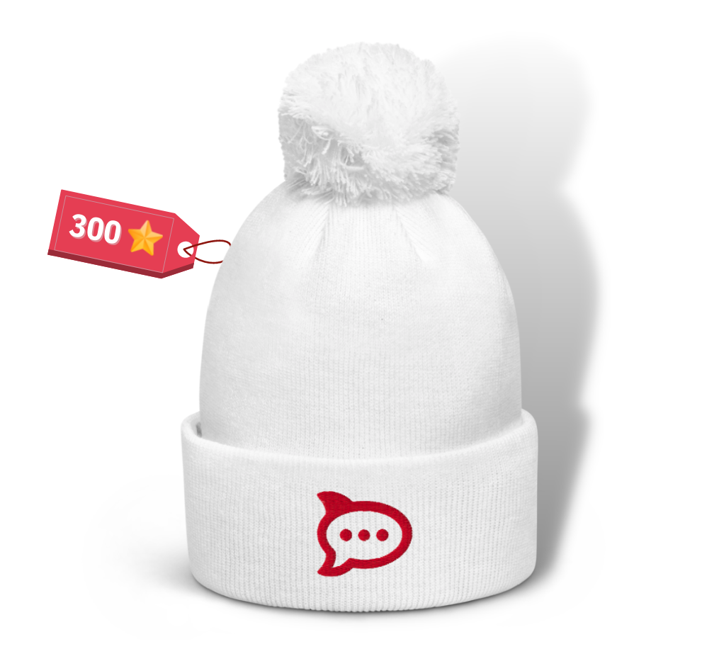
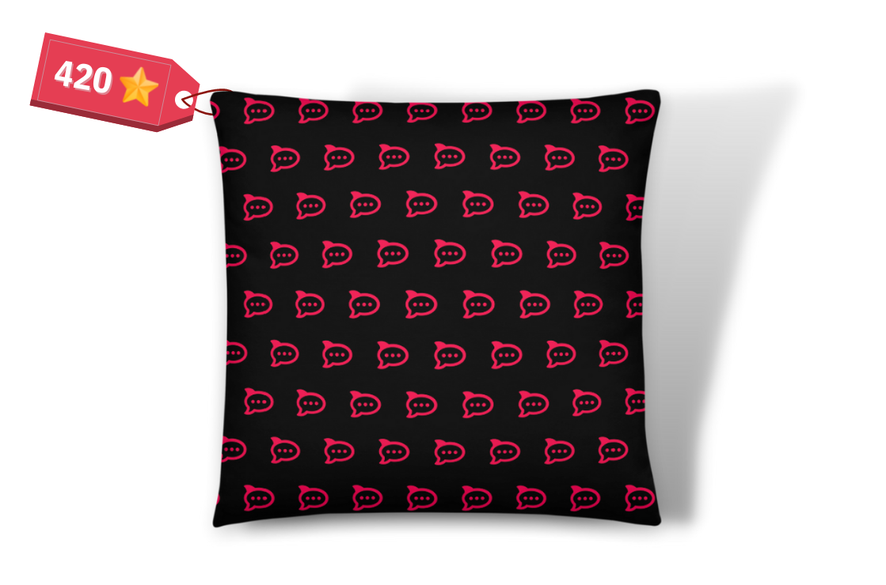
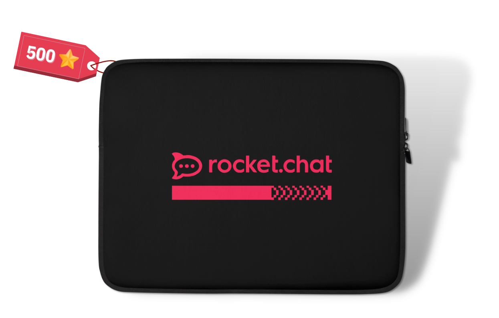
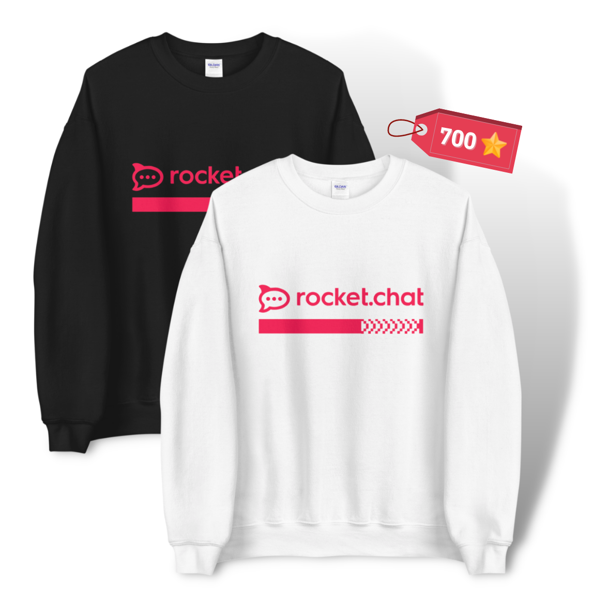

# Rocket.Chat RockStars

Our culture is one of the most significant strengths within Rocket.Chat, and we want to acknowledge actions that promote it.&#x20;

Welcome to Rocket.Chat RockStars! Our system enables you to earn stars by embodying the DOTS values or by participating in specific events and occasions. You can collect these stars and exchange them for prizes.&#x20;

All products within the stars program are purchased through [Printful](https://www.printful.com/uk/custom-products), where you can browse the entire catalogue of products. Some items are also available for purchase through the [Shopify](https://rocket-chat.myshopify.com/) store.&#x20;

### What Type of Stars Can I Get?

We have three different categories:

* **Request and Collect:** Whenever you act in this category, you can submit this action for approval to our Avengers within the system (Zoho People) and collect your stars!
* **Automatic Collection:** Stars are automatically collected on special occasions, such as birthdays, company anniversaries, or when you use the rocketchat-thanks channel to express gratitude for someone.
* **Admin Allocation:** These stars will be added to your account by the administrator of the specific tool. For instance, you'll receive stars from the Qulture.Rocks admin each time you complete your IDP or achieve 100% completion of the Check-in. In this case, the Qulture.Rocks admin will assign the stars to you within the system.

Let's take a look at the [list of actions and events](https://docs.google.com/spreadsheets/d/1GfdttY-0eFtzY5ZerPKRaAwvSQGaxjbFSZsa4RoebuA/edit#gid=0) in each category and the number of stars you can get:

<figure><figcaption></figcaption></figure>

### Important Notes:

1. The categories **"share content selected to be promoted"** and **"create an original post for LinkedIn"** are monthly only, meaning you can get that point once a month. The Marketing team assigns monthly campaigns applicable to these categories. You can get the stars just by sharing the selected content on LinkedIn or by writing your post directed to that campaign!
2. As mentioned before, for **"completing a course"** and **"years in company anniversary"**, your total of stars will be the base value multiplied by the course number of hours or by the number of years you're celebrating. The maximum of stars you can get for a course is 50.
3. The **"koko 1:1"** category gets you the stars if you do at least **"one random 1:1 in the month"**, and the same logic applies to the **"koko Thanks",** which works if you give or receive at least one thanks in the month.
4. The **"book club"** category follows [these rules](https://handbook.rocket.chat/departments-and-operations/people/developing-yourself/book-club).
5. The **"check-in and IDP"** categories are taken directly from a Qulture.Rocks report.
6. For **"father's and mother's day"**, you need to fill in a field in your Zoho People profile for it to be automatically collected.&#x20;

### How to Request My Stars?

The first thing you should do is go to Zoho People > Compensation > RockStars. Then, add a Credit request according to the action you completed.&#x20;

1. When submitting your request select "Credit"**,** the date, and the point classification.
2. After that, the “Reference” space will show how many stars that action is worth.&#x20;
3. Fill in the number of points needed, and submit!&#x20;

### Where Do I See How Many Stars I Have?

Simply go to your Zoho People profile to see your Koko Points balance! **Remember**: The stars are capped at a total of 1200, so even if you request more stars, after reaching this total it will be maintained until you exchange some of them.

**Remember**: the stars are capped at a total of 1200, so even if you collect more stars, after reaching this total it will be maintained until you exchange some of them for prizes.

### How Do I Switch My Stars For Items?

When you want to trade your stars for a product, request "Debit" (Zoho People > Compensation > RockStars).

1. Select "Debit", the product you want, and fill out the points field with how many stars it costs. Remember to always check your koko points balance before requesting the item to make sure you have enough to get it!
2. Then you just have to wait for an Avenger to approve your request, and once we fulfil the order, your swag will be on its way to you!&#x20;

## **Now Let's Talk Prizes!**

Check out the list of Rocket.Chat products you can get below or [here](https://docs.google.com/spreadsheets/d/1GfdttY-0eFtzY5ZerPKRaAwvSQGaxjbFSZsa4RoebuA/edit?usp=sharing).






















































































