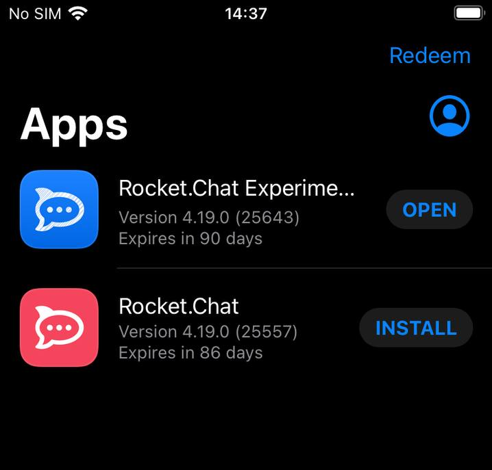

# Mobile Testing

To test a mobile build, the tester requires access to specific services and must know how to locate the relevant build. This applies to all teams.&#x20;

This article aims to equip testers with the knowledge necessary to test any mobile build.



## iOS

For iOS testing, the tester will need an Apple ID, as well as an invite to [TestFlight](https://developer.apple.com/testflight/), which can be downloaded directly from the App Store. Organize with a Mobile Developer to get the proper invitations.


Make sure to create the Apple ID using your Rocket.Chat email account.



You may also want to download the [App Store Connect](https://developer.apple.com/app-store-connect/) app to monitor the app's reviews on Apple, but that's not a requirement.


After downloading the apps, and being properly invited, you should be able to see the list of apps you have access to in your TestFlight app

It should look similar to this:

<figure><figcaption></figcaption></figure>

Normally, both the Experimental App and the Official App should be tested from here. To determine which version to test, refer to the CircleCI Workflow related to the task in question.

### Confirming the tester has the right build 

Below, there's a common CI workflow that has both iOS and Android Experimental builds ready for testing.

<figure><figcaption>
An example of a CircleCI Workflow
</figcaption></figure>

To find and confirm the iOS experimental build that the tester needs to install on their device, click on _**ios-build-experimental**_.

On this new screen, you may see the number of the build on the breadcrumbs on the top of the page like so:

<figure><figcaption>
An arrow points to the number 25575
</figcaption></figure>


**Pro Tip:** You may see the number through the url preview that appears at the bottom of your browser while _hovering_ the _**ios-build-experimental**_ button.\



The tester may use this number to find the specific build on TestFlight by tapping on the app and going to _Previous Builds_, If necessary.

Once Installed, the tester may confirm the version number in a couple of places inside the app, before and after logging in.

.png>).png>)



## Android

For Android, testing is done through [Google's Internal App Sharing](https://play.google.com/console/about/internalappsharing/).&#x20;

The development team uploads the app bundle or APK through that service, and the tester downloads it using the specific link generated during the CircleCI workflow.

The tester must be added as an "Authorized Tester". Organize with a mobile developer to get the proper authorization.


Remember to use your Rocket.Chat's email through the authorization process.


Once the tester is properly invited, they will be able to access the link provided by the DEV team to download the app bundle or APK.&#x20;

Without authorization, Google won't allow them to download the app even If they have the link.

### &#x20;Getting the link and downloading the app

The simplest way to obtain the link to the uploaded AAB to internal App Sharing is through the CircleCI workflow.

Below, there's a common CI workflow that has both iOS and Android Experimental builds ready for testing.

<figure><figcaption>
An example of a CircleCI Workflow
</figcaption></figure>

To find and confirm the Android experimental build that the tester needs to install on their device, click on _**android-internal-app-sharing-experimental.**_

Once redirected, scroll down to the _**Fastlane Play Store Upload**_ section and copy the link as shown below.&#x20;

<figure><figcaption></figcaption></figure>

This link should be opened through the mobile device.


To make it easier and faster, a QR Code generator could be used. [Like this one.](https://www.qr-code-generator.com)


### Confirming the tester has the right build 

On the same CircleCI workflow, click on _**android-build-experiemental**_ and check the number at the top of the page.

<figure><figcaption></figcaption></figure>

Once Installed, the tester may confirm the version number in a couple of places inside the app, before and after logging in.

.png>).png>)



