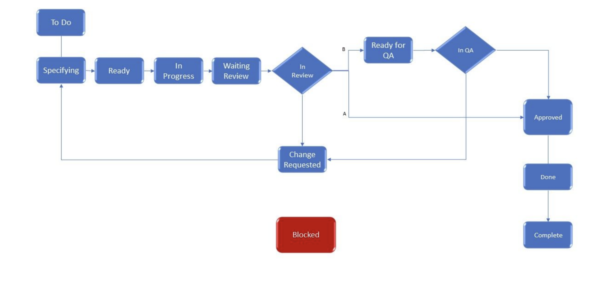

# QA integration

QA work and process is seamlessly integrated with development and design, adopting Scrum and Agile methodologies, with at least one QA analyst embedded in each squad that the company is divided on.

This is the updated list of squads that have a fully QA coverage:

* **Team Collab**
* **Omnichannel**
* **Mobile**
* **SAAS**

In each case the process is very similar, with QA entering very early in the development process, just after each PR is merged to master. Each QA team will manually test the task described in the ticket and also save the test case for a potential addition to the automated regression.

The ticket flow agreed to use in each team is as follows:

Once each team completes the tasks assigned to the sprint, there's a release candidate which get tested with a regression suite, fully automated and integrated with the CI.

