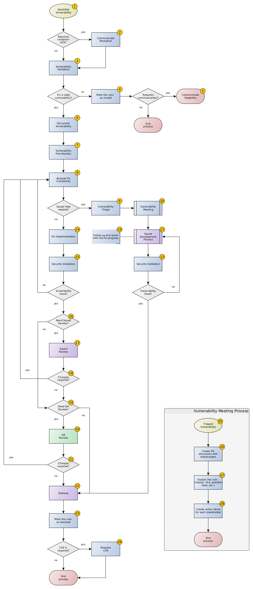
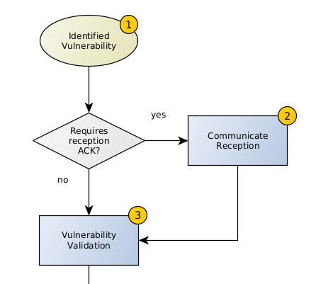
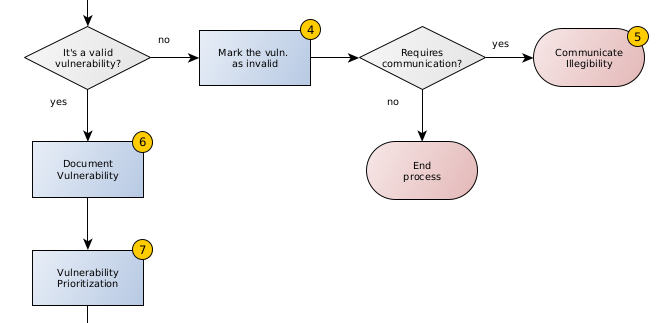
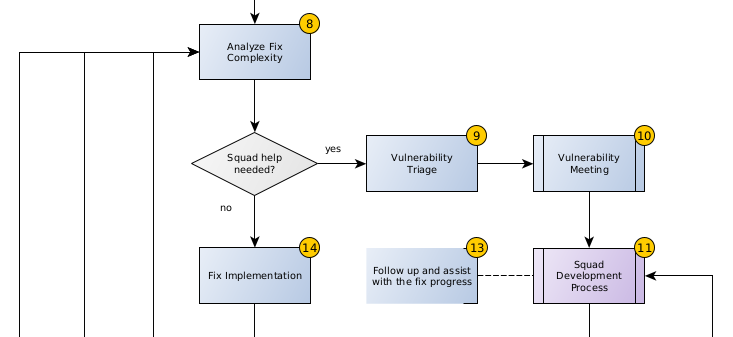
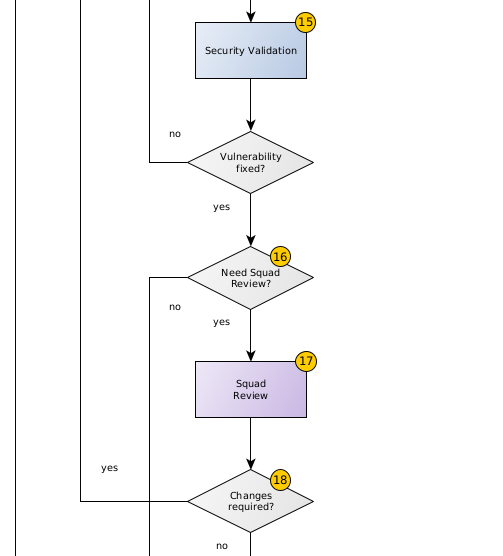
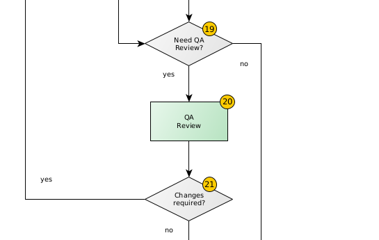
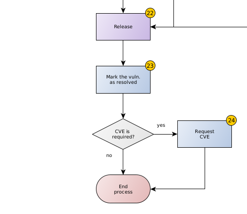
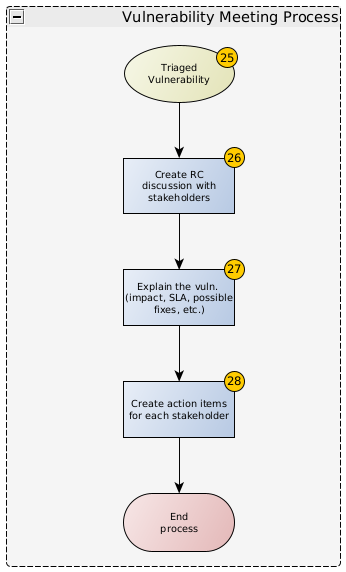
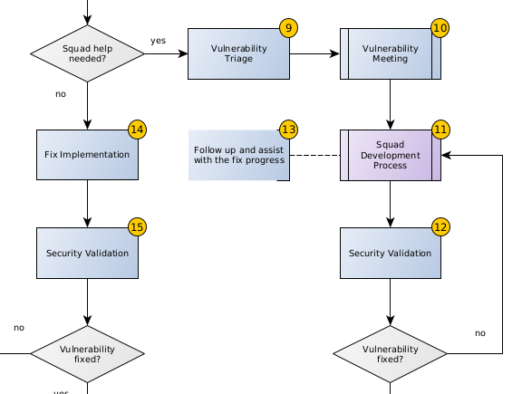

# Vulnerability Management Process

### Objectives

This document outlines how Rocket.Chat's teams handle vulnerability management to identify, validate, prioritize, and mitigate security vulnerabilities in company's assets.

This process aims to minimize our exposure to security risks, maintain compliance with security standards, safeguard the privacy of all users, and clarify the roles and responsibilities of each team/squad involved.

### Scope

The scope of this vulnerability management process is crucial for determining its coverage within Rocket.Chat. This includes identifying the systems, applications, and assets that will undergo vulnerability assessment, prioritization, and remediation.

* Infrastructure: this includes all the assets and resources managed within the OVH and AWS platforms.
* Applications: this includes all the services and web applications used and hosted by Rocket.Chat.
* Source Code: this includes the source code developed in all the open and private repositories under the Rocket.Chat Github organization.

### Vulnerability Identification

To identify and gather information about the vulnerabilities present across the entire Rocket.Chat's scope, the company uses several techniques and tools, including but not limited to the following list of vulnerability sources:

* Tenable.io: as an internal and external vulnerability scanner for both applications and infrastructure assets.
* Trivy: as a container and Infrastructure as Code (_IaC_) scanner.
* Kube-hunter: as a Kerbernetes cluster vulnerability scanner.
* Snyk: as a third-party dependency scanner.
* Prowler: as an AWS vulnerability scanner platform.
* In-house Pentests: penetration tests performed by the Rocket.Chat Security team over the internal and external assets owned by the organization.
* Third-Party Pentests: penetration tests performed by third-party companies over Rocket.Chat's internal and external assets owned by the organization.
* HackerOne: as a public Bug Bounty Program (_BBP_) to receive vulnerability reports from external security researchers.

### Vulnerability Management Process

### Objectives

This document outlines how Rocket.Chat's teams handle vulnerability management to identify, validate, prioritize, and mitigate security vulnerabilities in company's assets.

This process aims to minimize our exposure to security risks, maintain compliance with security standards, safeguard the privacy of all users, and clarify the roles and responsibilities of each team/squad involved.

### Scope

The scope of this vulnerability management process is crucial for determining its coverage within Rocket.Chat. This includes identifying the systems, applications, and assets that will undergo vulnerability assessment, prioritization, and remediation.

* Infrastructure: this includes all the assets and resources managed within the OVH and AWS platforms.
* Applications: this includes all the services and web applications used and hosted by Rocket.Chat.
* Source Code: this includes the source code developed in all the open and private repositories under the Rocket.Chat Github organization.

### Vulnerability Identification

To identify and gather information about the vulnerabilities present across the entire Rocket.Chat's scope, the company uses several techniques and tools, including but not limited to the following list of vulnerability sources:

* Tenable.io: as an internal and external vulnerability scanner for both applications and infrastructure assets.
* Trivy: as a container and Infrastructure as Code (_IaC_) scanner.
* Kube-hunter: as a Kerbernetes cluster vulnerability scanner.
* Snyk: as a third-party dependency scanner.
* Prowler: as an AWS vulnerability scanner platform.
* In-house Pentests: penetration tests performed by the Rocket.Chat Security team over the internal and external assets owned by the organization.
* Third-Party Pentests: penetration tests performed by third-party companies over Rocket.Chat's internal and external assets owned by the organization.
* HackerOne: as a public Bug Bounty Program (_BBP_) to receive vulnerability reports from external security researchers.

### Vulnerability Management Process

<figure><figcaption>
RocketChat's Vulnerability Management Process
</figcaption></figure>

The current process starts with an identified vulnerability (1) from any of the vulnerability sources described in the Vulnerability Identification section.

In cases where a new vulnerability is identified, an acknowledgment of receipt (2) may be required. In such cases, the Security Team will be in charge of this communication. Examples of this could be the case of Bug Bounty reports coming from the HackerOne platform.

Right after, the Security Team will start the Vulnerability Validation (3) process, where they will try to reproduce the potential security issue and determine its eligibility.\

<figure><figcaption></figcaption></figure>

If the vulnerability is deemed invalid, the Security Team will close the associated JIRA ticket (4) and, if necessary, communicate its status (5), thus completing the process.

If the vulnerability is valid, the Security Team will add, if needed, contextual information (6) to the ticket documentation like screenshots, references, recorded PoCs, and internal information to improve the vulnerability understanding and the consequent mitigation process.

Then, the Security Team will prioritize the issue (7) assigning it a severity and the corresponding SLA.

<figure><figcaption></figcaption></figure>

Following the prioritization of vulnerabilities, the Security Team will assess the complexity of fixing (8) each vulnerability and determine if they have the necessary resources to address it on their own.

If additional support is required from development squads, the Security Team will start the vulnerability triage (9), and assign the vulnerability JIRA ticket to the relevant squad. If multiple squads need to be involved, the original ticket will be cloned and linked to each squad's JIRA project. The Security Team will then initiate a Vulnerability Meeting Process (10) with the involved squads.

If the Security Team has all the resources needed, they will implement the proper fix for the vulnerability (14).

<figure><figcaption></figcaption></figure>

Once the fix is in place, the Security Team will validate (15) if it mitigates the vulnerability. If not, they will repeat the process, starting from the evaluation of the fix complexity (8).

Then, depending on the type of vulnerability, the Security Team will determine if a Squad needs to review the fix (16). If so, they will ask the relevant Squad to carry out a review (17).

Once the Squad has completed the fix review, the Security Team will check if they need to modify the solution based on the Squad's feedback (18). If necessary, the Security Team will repeat the process from the fix analysis stage (8).

<figure><figcaption></figcaption></figure>

Subsequently, the Security Team will check if the solution meets the criteria for a QA review (19) to prevent any interference with current features or functionalities. Once confirmed, they will request the review to proceed.

Upon completion of the QA review (20), any functional issues identified will need to be addressed by the Security Team. If changes are required (21), the process will restart from the fix analysis stage (8).

<figure><figcaption></figcaption></figure>

Once the fix has been reviewed and approved, the involved squads will proceed with deploying the patched asset (22). Only after, the Security Team will close the associated vulnerability ticket as resolved (23), and if necessary, will also create a CVE request to conclude the process (24), depending on the nature of the vulnerability.

<figure><figcaption></figcaption></figure>

### Vulnerability Meeting Process

The Vulnerability Meeting process aims to establish an agile communication and collaboration channel when the Security Team requires assistance from the Squads to fix an identified vulnerability (10).

<figure><figcaption></figcaption></figure>

This process will start with a triaged vulnerability (9, 25).

First, the Security Team will create a Rocket.Chat discussion in a private channel (26) and invite the necessary Product Owners and Engineering Managers of the Squads involved.

In this discussion, the Security Team will inform stakeholders (27) about the issue's details, including its severity, associated SLA, and potential solutions. They will also provide stakeholders with the option to schedule a meeting to discuss the issue further.

Next, the Security Team will create action items (28), in the form of JIRA tickets, for each of the involved stakeholders.

The Squad responsible for fixing the vulnerability will follow their normal development workflow (11). Once the fix is complete, the Squad will request the Security Team a security validation (12) to confirm if the vulnerability has been mitigated. If the fix doesn't mitigate the vulnerability, the Security Team will provide recommendations to the Squad on how to fix it and the Squad will repeat the development process (11). If the vulnerability is successfully resolved, the process will continue as usual to release the patched asset (22).

<figure><figcaption></figcaption></figure>

Depending on the SLA, the Security Team will request regular updates (13) on the progress of the fix and assist the responsible developers with any concerns until the vulnerability is resolved and the process is complete.
