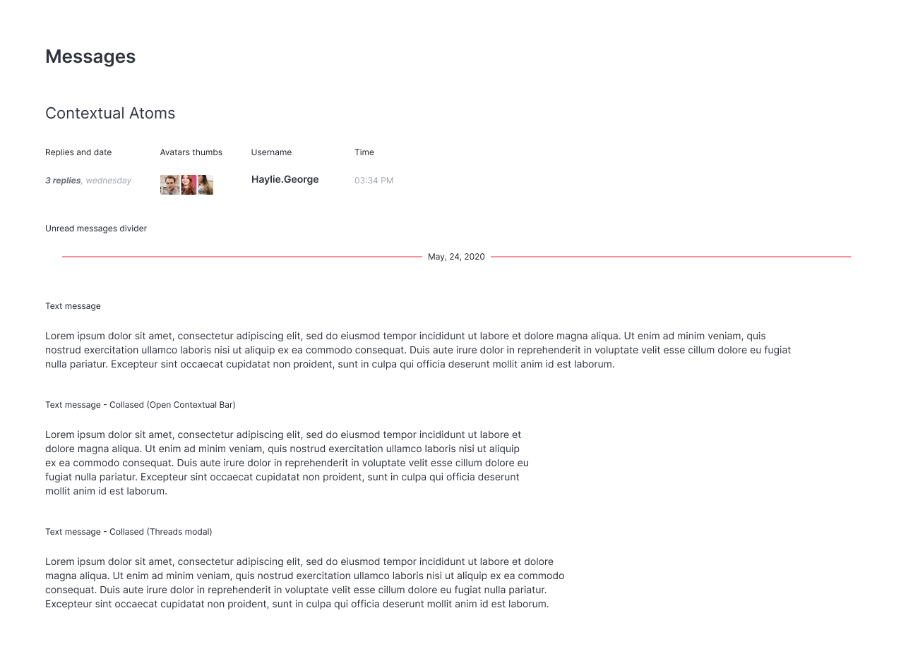
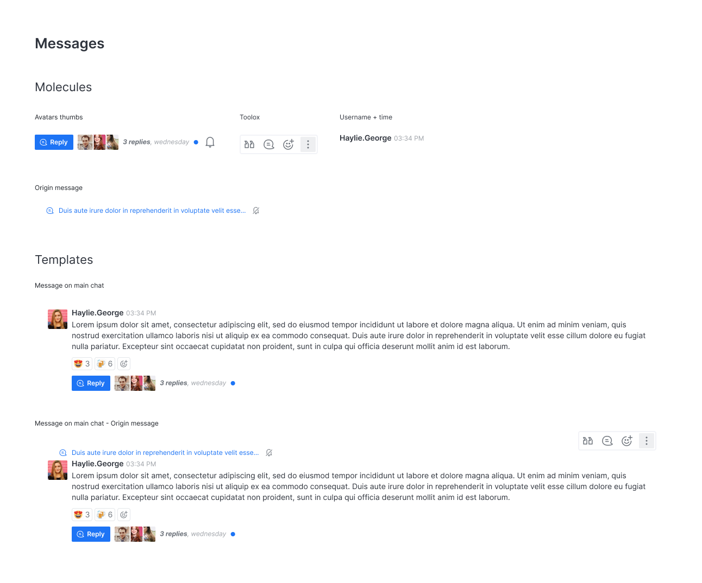
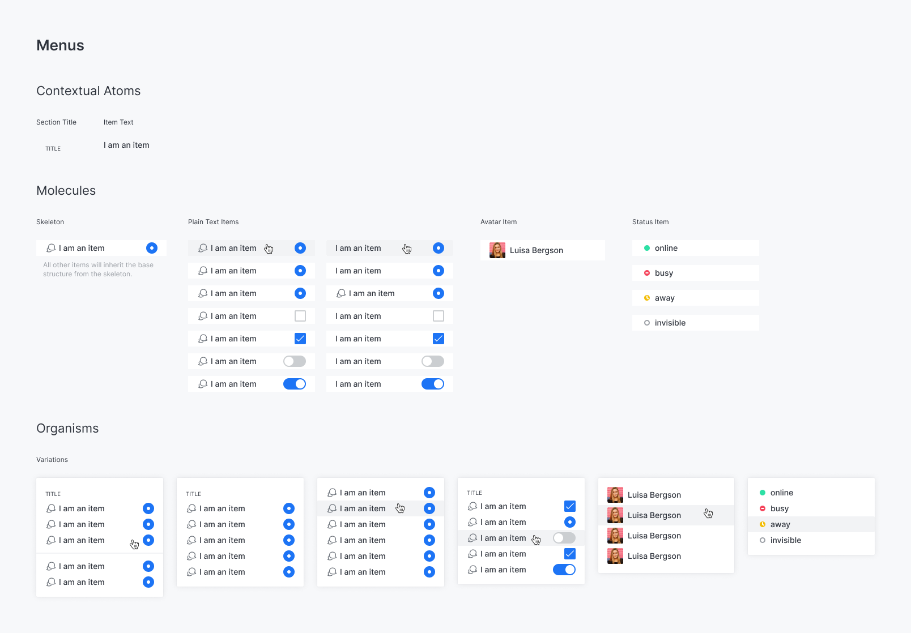
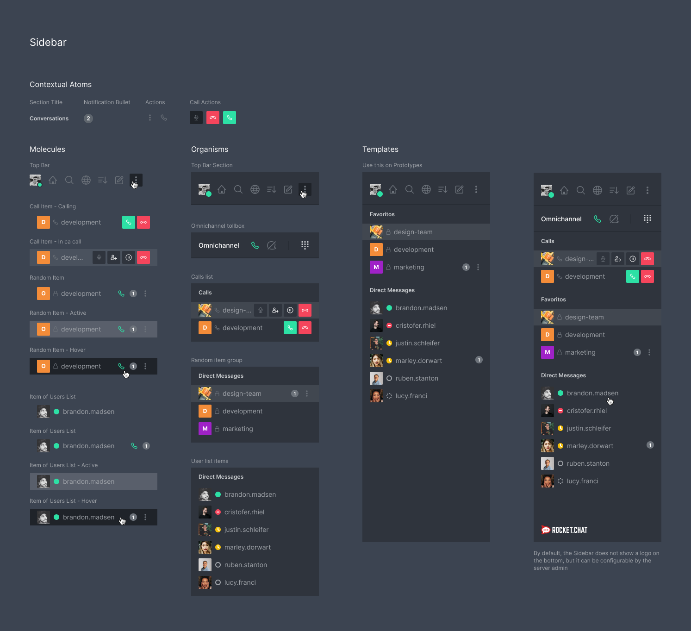

# Design Building Pieces

## Atoms 

Atoms are the smallest piece of User Interface we can build, some of them must be used just on specific places and other ones can be spread throughout the application. Furthermore, they have been separated in two types.

Be careful when creating and specially when editing Atoms, since they can be applied anywhere in the applications, they have en exponential risk to break things you are not aware.

### Global Atoms 

Are those Atoms which can be used anywhere in the system, it guarantees consistency and so the ease to learn.

### Contextual Atoms 

This type of component is based on its context and responsibilities and must not used in a context or be responsible for something it was not initially created for. In the end, they do not make sense outside of their context, look at the example below:

The design of each component is based on their meaning so using a component for something it was not initially created increases the probability of breaking the design somewhere else.

Using Contextual Atoms in their respective place makes much more sense, look at the example below:

## Molecules 

Are a composition of Atoms, usually shape rows or columns. Often they build items of a list. You can notice in the image below a few Contextual Atoms and Global atoms shaping molecules.

## Organisms 

Shape blocks of Molecules. Its responsibility is to wrap Molecules and also may add a few other Atoms around it.

## Templates 

The finality of the previous component types is to be part of a Template. A user will not use neither an Atom, Molecule nor Organism, rather then this, they will use the Templates, which have the responsibility to help them to accomplish their daily tasks while using the application.

