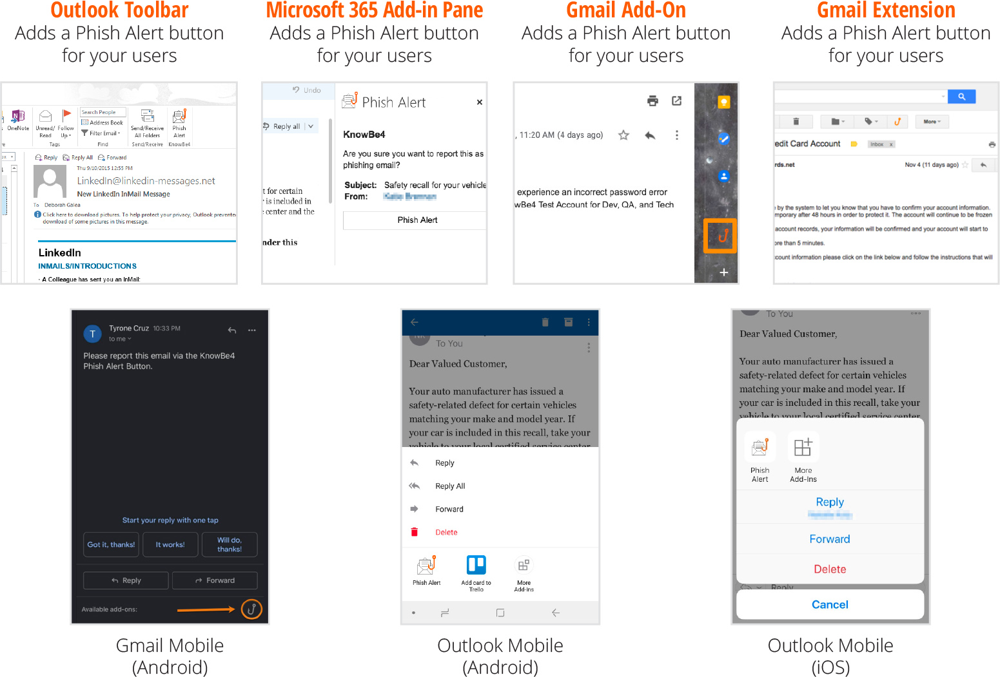

# Paid Time Off Policy

Rocket.Chat encourages everyone to take some paid time off \(PTO\) off whenever you need it, be it for visiting exotic places or just taking some time for yourself. This is important for maintaining a healthy work/life balance.

## PTO Guide

1. You may take as many days off as you want, as long as your work is organized and in order, i.e. that your work or responsibilities are not compromised by your absence.
2. We suggest between 10 and 30 days of vacation per year.
3. We care about your results, not for how long you work. Your time off shouldn’t be at the expense of business getting done. Please coordinate with your team before taking time off, especially during popular or official holidays, so that we can ensure business continuity. We want to ensure we have adequate coverage and avoid situations where all/most of the team is taking time off at the same time.
4. We don't frown on people taking time off, but rather encourage people to take care of themselves and others by having some time away. If you notice that your co-worker is working long hours over a sustained period, you may want to let them know about the time off policy.
5. Emergencies, by definition are unexpected. They can range from natural disasters, accidents, family deaths, hospitalization and any other unexpected situation. During these times we ask team members to use their best judgement as well as listen to and adhere to public safety officials when possible. If an unexpected emergency occurs please contact your manager by any means possible, and as soon as possible, if you will be unavailable or unable to work. This will allow your manager to confirm your safety and reassign any critical work during your absence. 
6. When you decide which days you want to take off, please request them in [Zoho](https://people.zoho.com/rocketchat/zp#leavetracker/applyleave) so that everyone knows you will be away during that period.
7. You are free to take some time off to go to the gym, go grocery shopping, take a nap, do household chores, help someone, etc. If something comes up or takes longer than expected, you have urgent tasks and you're able to communicate, just ensure the rest of the team knows and someone can pick up any of your urgent tasks.
8. Being part of a global onsite/remote team means you need to be highly organized and a considerate team player. Each team has busy times so it is always a good idea to check with them to ensure there is adequate coverage in place.
9. Don't forget to always check with your line manager and/or project manager before requesting time off. This is to ensure no deadlines are being overseen and to provide them with enough time to accommodate resources. The following question will help determine if you may take time off: "During that time, will someone be able to take over your duties? Does this someone need training?"
10. After the PTO has been approved, update your own calendar using Google's "out of office" feature and include the dates you plan to be away in your automated response. Note that this feature will automatically decline any meeting invitations during the time frame you select.

## Workflow for Requesting Time Off

Access your [Zoho People Dashboard](https://people.zoho.com/rocketchat/zp#home/dashboard) and click on Apply Leave \(top-right\):

Choose the Leave type \(see below\) from the available options:

Some types will offer you an option to choose between days or hours you're taking off. After selecting the type, you'll need to enter the Dates for your application and the Reason for leave.

The reason is a courtesy of yours to help your manager tell others why you are in PTO.

Remember that balances are a **suggestion** by the company. You are allowed to use more or less than your balance during the year. **Balances reset on your joining date.** You can check how your leave request affects your balance by looking at the right side of your request page:

Finish your request by clicking on the blue Submit button, in the page footer. Your manager gets an e-mail to approve your request. If he/she doesn't approve in a couple of days, don't hesitate to contact them directly.

## Types of Time Off

1. **Doctor's Appointment**: usually a few hours on any given day
2. **Event**: when you're attending an event, whether sponsored by Rocket.Chat or not
3. **Half-day**: for when you know you'll be available / unavailable for just a few hours
4. **Sick / Doctor's Order**: whenever you're sick or following doctor's orders
5. **Maternity**: duh, paternity as well :\)
6. **Casual**: whenever you feel you need some time-off, up to 5 days in a row; for more than 5 days, use **vacation** type**.**
7. **Vacation**: for periods longer than 5 days in a row and not in any other category above.

## Recognizing Burnout

It is important for us to take a step back in order to recognize and acknowledge the feelings of being "burned out". We are not as effective or efficient when we work long hours, miss meals or forego nurturing our personal lives for sustained periods of time. If you feel yourself or notice someone on your team experiencing burnout, be sure to address it right away. To get ahead of a problem, be sure to communicate with the COO and/or CEO if the following statement ever applies to you, "I'm feeling like I might burn out if the situation doesn't change."

If you or your peers are showing signs of burnout, you should take time out to focus on things that relax you and improve your overall health and welfare. We as a team should address burnout right away by discussing options with each other to evaluate the workload and manage contributing stressors.

Other tips to avoid burnout include:

* Assess and pursue your interests, skills and passions
* Take breaks during the day to eat healthy foods
* Make time each day to increase blood and oxygen circulation which improves brain activity and functionality
* Get plenty of restful sleep

