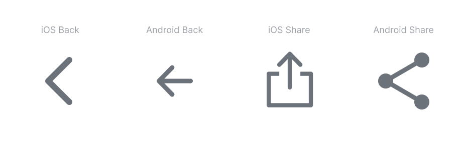
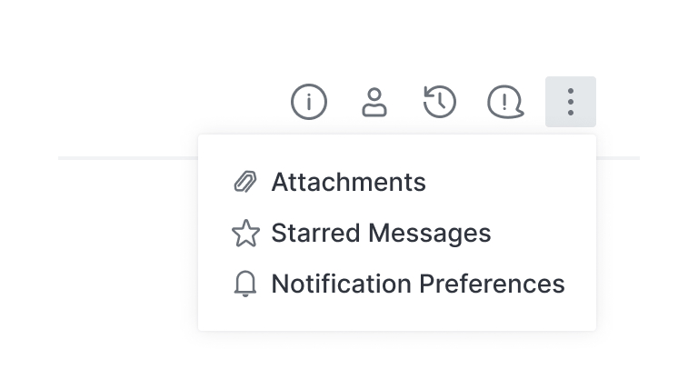
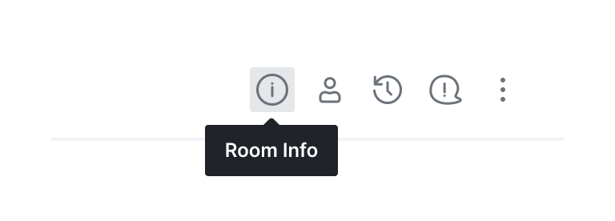
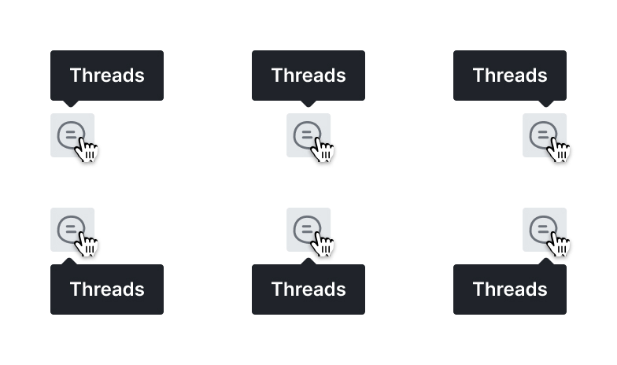
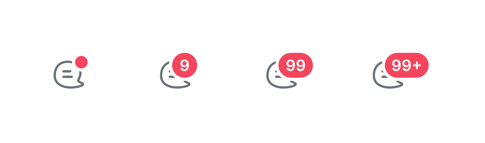
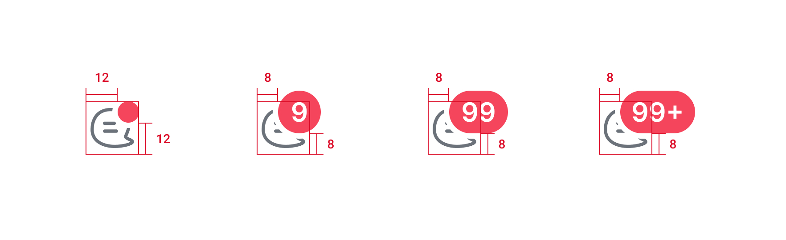

# Iconography

Our icons are simple, clear, and consistent. Our goal is to make creating and using the icon consistent across different platforms. A consistent way of using the icon helps reduce the learning curve.

## Design principles

## Design Principles

## Design principles

1. Simple — Our icons are geometric, recognizable on small screens, and have minimal form.
2. Clear — Whenever possible use symbols that represent the most basic representation of what it stands for.
3. Consistent — In style, detail, perspective, stroke weight, and the way it is used. Don't recreate established and standard icons.

## Creating Icons

### Canvas Size

The icons are displayed most of time as 20x20px and 24x24px. However, by default, the icon must be drawn using the 32x32px grid.

### Grid and Keylines

Rocket.Chat icons are drawn on a pixel-based grid of 32px x 32px and scaled down to different sizes. Use the grid's keylines to shape the main structure.

### Stroke

They must be draw using 2px strokes on 32x32px canvas.

### Stroke Caps

They must be rounded.

### Corners

Corner radius must be 1px by default. Interior corners should be squared, not rounded.

### Perspective

1. Always keep the icon simple and face forward.
2. Icons should have no perspective nor have a large amount of detail. 

### Naming Icon

We follow this naming pattern for icons: `Glyph / iconname-typename`.

* Glyph / audio
* Glyph / audio-disabled
* Glyph / send-filled

## Using icons

* Primary navigation
* Page headers and section titles
* Banners to bring attention to a specific theme \(such as a success or an error\)
* Combination with text to add clarity
* primary navigation
* page headers and section titles
* banners to bring attention to a specific theme \(such as a success or an error\)
* combination with text to add clarity

### Cross-platform adaptations

Icons like Share and Back has a different icon for Android and iOS. We follow their specific guidelines to make our product more familiar and easier to learn.

### Meaningful and Minimalist

Use meaningful icons instead of words when possible, following the Rocket.Chat's design principle of [Minimalim](../principles.md#minimalism). 

### Labels

Add a label to reduce the ambiguity of the icon's purpose when the context allows. The label must follow the [Capitalization Rules](capitalization-rules.md).

### Tooltips

Use tooltips for unlabeled icons — include a label or a short description. This reduces the cognitive load while learning the applications' concepts.

A tooltip and a icon \(or a button which contains a icon\) must be 4px distance between both elements' canvas and have a centered alignment.

Use tooltips on unlabeled icons — include a text label, the keyboard shortcut, or a short description of what the icon means. This reduces the effort of learning unfamiliar icons.

#### Tooltip Position

You can put the tooltip from top to bottom and from left, middle, and right of the object. As much as possible we will automatically reorient the tooltip depending on the object position.

1. The default position is on the bottom, you can switch to the top when needed.
2. They are aligned 4px distance from the related object

### Badges on Icon

Badges can be used together with icons to inform the user of their statuses like the number of new notifications or unread messages. 

#### How Badges Work

Include a + symbol when the badge status amount is more than 99 to clearly inform the user that there is more than 99. There are 2 types of badges, with numbers and badge without numbers.

1. Use badge with number when the status can be counted and when it's important, urgent, or relevant to the user. For example, number of notification and number of unread messages\)
2. Use badge without number when it's not important to the user or when the status is binary. For example, the user is online/offline status or a new product update.

#### Badges Position

1. By default, badges are aligned to the top and end edges of its anchor object \(with some offsets\).
2. The badge margin adjusts with their anchor object depending on the badge content.
3. It has 2px outline that dynamically change it's color depending on the object background.












Ask a designer when you have a question, suggestion or you're requesting a new icon.


## Helpful articles

* [Optical Effects in User Interfaces](https://medium.muz.li/optical-effects-9fca82b4cd9a)
* [Material Design System Icons](https://material.io/design/iconography/system-icons.html#grid-and-keyline-shapes)
* [Apple System Icon Specs](https://developer.apple.com/design/human-interface-guidelines/ios/icons-and-images/system-icons/)

