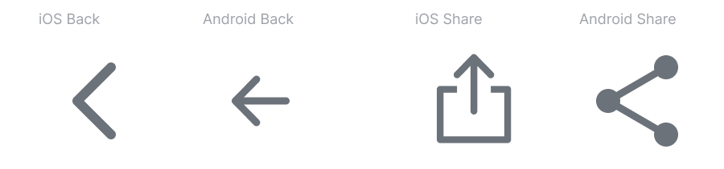

# Iconography

## Design Principles

1. Simple — Our icons are geometric, recognizable on small screens, and have minimal form.
2. Literal — Whenever possible use symbols that represent the most basic representation of what it stands for.
3. Consistent — In style, detail, perspective, stroke weight, and the way it is used. Don't recreate established and standard icons.

## Creating Icons

### Canvas Size

The icons are displayed most of time as 20x20px and 24x24px. However, by default, the icon must be drawn using the 32x32px grid.

### Grid and Keylines

Rocket.Chat icons are drawn on a pixel-based grid of 32px x 32px and scaled down to different sizes. Use the grid's keylines to shape the main structure.

### Stroke

They must be draw using 2px strokes on 32x32px canvas.

### Stroke Caps

They must be rounded.

### Corners

Corner radius must be 1px by default. Interior corners should be squared, not rounded.

### Perspective

1. Always keep the icon simple and face forward.
2. Icons should have no perspective nor have a large amount of detail. 

### Naming Icon

We follow this naming pattern for icons: `Glyph / iconname-typename`.

* Glyph / audio
* Glyph / audio-disabled
* Glyph / send-filled

## Using icons

### Cross-platform adaptations

Icons like Share and Back has a different icon for Android and iOS. We follow their specific guidelines to make our product more familiar and easier to learn.

### Meaningful and Minimalist

Use meaningful icons instead of words when possible, following the Rocket.Chat's design principle of [Minimalim](../principles.md#minimalism). 

### Labels

Add a label to reduce the ambiguity of the icon's purpose when the context allows. The label must follow the [Capitalization Rules](capitalization-rules.md).

### Tooltips

Use tooltips for unlabeled icons — include a label or a short description. This reduces the cognitive load while learning the applications' concepts.

A tooltip and a icon \(or a button which contains a icon\) must be 4px distance between both elements' canvas and have a centered alignment.


Consult a designer when you have a question, suggestion or you're requesting a new icon.


## Helpful articles

* [Optical Effects in User Interfaces](https://medium.muz.li/optical-effects-9fca82b4cd9a)
* [Material Design System Icons](https://material.io/design/iconography/system-icons.html#grid-and-keyline-shapes)
* [Apple System Icon Specs](https://developer.apple.com/design/human-interface-guidelines/ios/icons-and-images/system-icons/)

