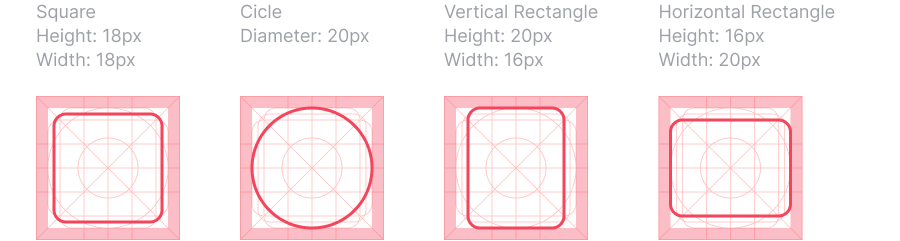
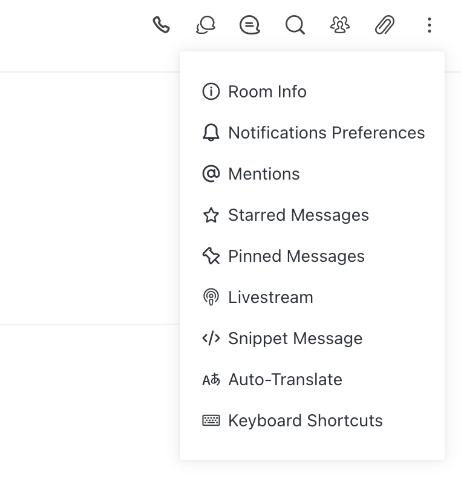
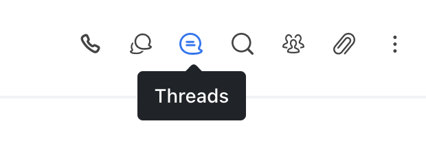

# Iconography

## Icons

Rocket.Chat icons are used to help our customers get the job done. Our icons are clear, readable, and informative.

Our goal is to make creating and using the icon consistent across different platforms. A consistent way of using the icon helps reduce the learning curve of our product and increase our customers' productivity.

## Design principles

1. Simple — Our icons are geometric, recognizable on small screens, and have minimal form.
2. Literal — Whenever possible use symbols that represent the most basic representation of what it stands for.
3. Consistent — In style, detail, perspective, stroke weight, and the way it is used. Don't recreate established and standard icons.

## Creating icons

### Canvas Size

The icons are displayed most of time as 20x20px and 24x24px. However, by default, the icon must be draw using 32x32px format and 2px stroke so we can convert it easily to 1.5px on 24x24px usage.

### Grid and Keylines

The icons are exported on a 32px canvas and must follow the grid below. We have predefined keylines on the grid that help to design icons more consistent and harmonic.

### Stroke

They must be draw using 2px strokes on 32x32px canvas.

### Stroke Caps

They must be rounded.

### Corners

Corner radius must be 1px by default. Interior corners should be squared, not rounded.

### Perspective

1. Always keep the icon simple and face forward.
2. Icons should have no perspective nor have a large amount of detail. 

### Naming icon

We follow this naming pattern for icons: `Glyph / iconname-typename`.

* Glyph / audio
* Glyph / audio-disabled
* Glyph / send-filled

## Using icons

Only use icons from our [official released set](https://www.figma.com/file/gC0Y4IH5uthUymNW85If7EA2/Styleguide?node-id=110%3A41).

### Icons are commonly used in

* primary navigation
* page headers and section titles
* banners to bring attention to a specific theme \(such as a success or an error\)
* combination with text to add clarity

### Cross-platform adaptations

Icons like Share and Back has a different icon for Android and iOS. We follow their specific guidelines to make our product more familiar and easier to learn.

### Labeling Icon

Use meaningful icons instead of words where you could. Add a label to reduce the ambiguity of the icon's purpose when the context allows.

Use tooltips for unlabeled icons — include a text label or a short description of what the icon means. This reduces the effort of learning unfamiliar icons.


Consult a designer when you have a question, suggestion or you're requesting a new icon.


## Helpful articles

* [Optical Effects in User Interfaces](https://medium.muz.li/optical-effects-9fca82b4cd9a)
* [Material Design System Icons](https://material.io/design/iconography/system-icons.html#grid-and-keyline-shapes)
* [Apple System Icon Specs](https://developer.apple.com/design/human-interface-guidelines/ios/icons-and-images/system-icons/)

