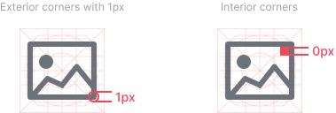

# Iconography

Icons are used as an attribute to help identify actions, files, and directions. They should be as simple as possible to be recognized and give the right message.

## Canvas Size

The icons are displayed most of time as 20x20px and 24x24px. However, by default, the icon must be draw using 32x32px format and 2px stroke so we can convert it easily to 1.5px on 24x24px usage.

## Stroke

They must be draw using 2px strokes on 32x32px canvas.

## Corners

Corner radius must be 1px by default. Interior corners should be squared, not rounded.

## Stroke Caps

They must rounded.

## Grid

The icons are exported on a 32px canvas and must follow the grid below.

