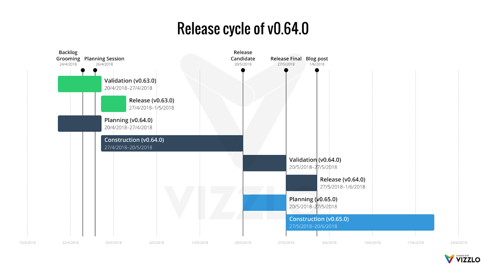

# Release Cycle

## What’s a release?

The release is every version of the app that’s sent to the store as a production release. The release is always a major/minor update, like from \(1.0.0 to 1.1.0 or to 2.0.0\). Patch releases \(from 1.0.0 to 1.0.1\) won’t follow this steps and are considered hotfixes releases. Our versioning is following the [Semantic Versioning 2.0.0](https://semver.org/) guide.

## How is our release cycle structured?

We choose to have fixed monthly releases, that means that under optimal circumstances we’ll have only one release per month. Each release should follow a specific life-cycle consisting of four distinct phases: _planning, construction, validation, release._ Usually _validation_ and _planning_ phases overlap.

* **Planning** `~5 work days`
  * Issue triage workgroup
  * Backlog grooming
  * Identification and refinement of requirements
  * Technical agreement
  * Planning session
* **Construction** `~15 work days`
  * Development
  * Write technical documentation \(at least at draft level\)
  * Peer review
  * Final review & merge
* **Validation** `~5 work days`
  * Get feedback
  * If the product needs further polishing start a new construction phase micro iteration
  * If there’s “free time” \(release is doing fine\), work to improve tests and technical debt, new ideas, experiments or features/improvements to the next release cycle
* **Release** `~3 work days`
  * Generate changelog
  * Review and polishing of technical documentation
  * Write a blog post about the changes, fixes and new features
  * Release final version of the product

## What are the important days of a release?

The first release candidate \(TestFlight and Beta\) needs to be done by the 20th of each month. The release will always happen on the 27th day of each month, unless there’s some critical crash/bug happening.

## What happens if something could not be done in time for the release candidate?

In general, if it’s a new feature, it’ll be postponed for the next release only. Under extreme circumstances, when it will result in significant business impact a extraordinary release could happen.

## When do we plan the release features/improvements/bugs?

Every month can be a different day between 20th and 27th to plan the next release. The leader of the team will schedule the team and the all team will be able to participate of the planning. At this moment, most of the issues will be assigned to each member of the team. As we can see in the following example \(in April, 2018\):

## How do we organize a release?

Every release is a project in GitHub. There are 6 columns on each project \(board\):

* **Desirable \(temporary\)**: what we want to have on the release. This is very useful while planning. This is where everybody can add features/improvements that wanna see on the release;
* **Blocked**: when something is blocked \(waiting asset, waiting API, etc\) the issue will be on this board;
* **To-do**: after planning, all to-do issues come here;
* **In progress**: when something is in progress, the issue/PR will be on this board;
* **Review/QA**: when something is done and waiting for review or waiting to be tested, the issue/PR will be on this board;
* **Ready to Merge**: when PR is reviewed and approved it will be o here waiting to final adjustments \(title, related issues, etc\) and merge;
* **Done**: when the issue is closed \(merged\), the issue/PR will be on this board;

## What happens with PRs and Issues not listed in a release?

Pull Requests and Issues not listed in the board will not be merged to that release. If some PR or Issue should be evaluated, reviewed or merged it should be listed in the board at the appropriated column.

## What happens when the release candidate is shipped?

All changes in develop needs to be merged into the branch release-candidate at this point. A new tag needs to be created following the pattern: `2.1.0-rc1`.

All the remaining Issues and PRs in the current board should be moved to the next board and assigned the the label `board-postponed`, leaving the current board for Issues and PRs related to the release candidate process only.

## What happens if there’s no bug/crash on the release candidate?

That’s great, congrats! This time can be used in a creative way: write more tests, code maintenance that sometimes is required, resolving issues to the next release, planning, ideas and experiments.

## What happens when a release candidate fix is not done before the release?

The fix will be shipped as a Hotfix Release, see the `Hotfix Releases` section.

## What happens when the release is done?

Project and milestones are closed, all the changes are merged to the branch master and the tag is created, following the release pattern of the repository.

## Hotfix Releases

### When a hotfix release happen?

A Hotfix release will happen when a critical bug or crash is found in the production version of the app.

### How to handle hotfix releases?

Simply open an issue on GitHub describing the issue, the issue is usually closed from a pull-request getting merged and a new milestone is created with the minor update, including all PRs required to the hotfix be completed. Once the milestone is completed, it can be closed and the release tag can be created.

## Check more





