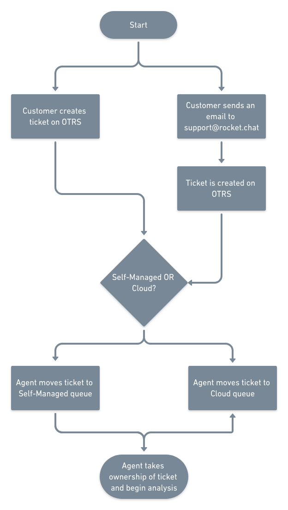
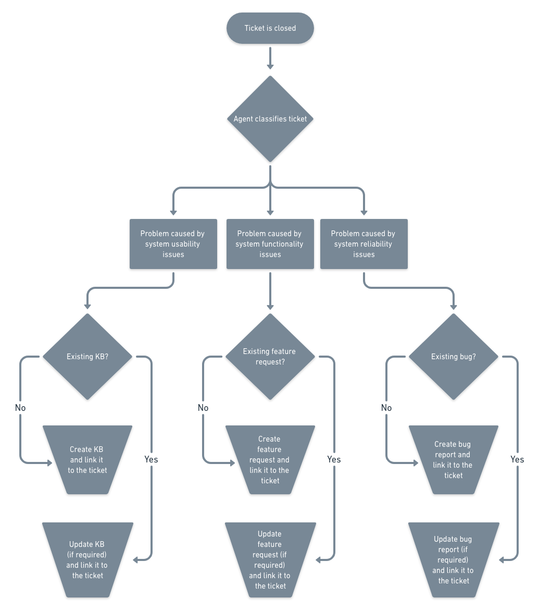

# Processes

## Basic support workflow

## Follow-up workflow

In summary closed tickets should have one of three possible outcomes:

- If it's a **usability** issue, an existing document should be linked to the ticket and/or updated to reflect new knowledge
- If it's a **functionality** issue, an existing GitHub feature request should be linked to the ticket and updated or a new one created to raise visibility to the customer request
- If it's a **reliability** issue, an existing GitHub bug should be linked to the ticket and updated or a new one created to raise visibility to the problem reported
