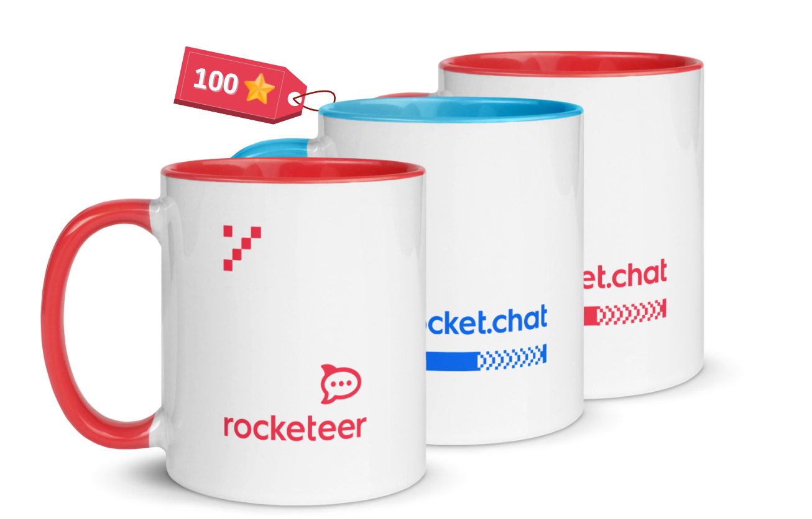
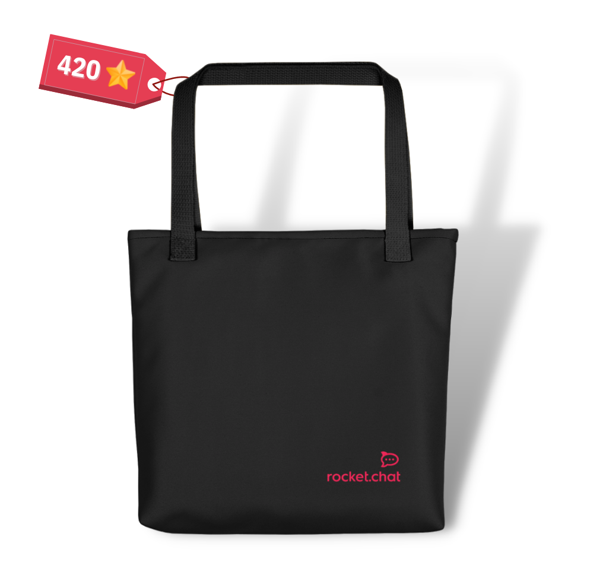
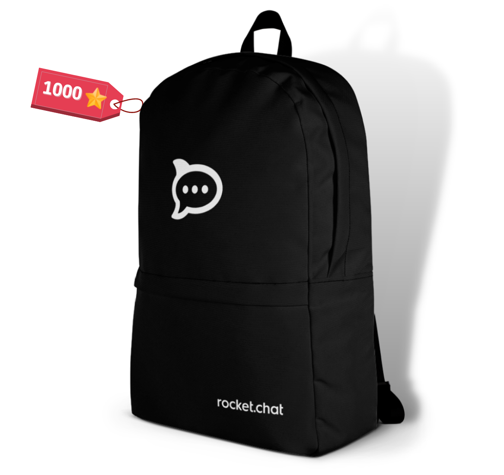

# Rocket.Chat RockStars

Our culture is one of our biggest strengths within Rocket.Chat, and we want to recognize the actions that promote it, so welcome to Rocket.Chat RockStars! Our system enables you to collect stars by representing the DOTS or on specific dates and occasions, accumulating them, and exchanging them for prizes!

We buy all products within the stars program through [Printful](https://www.printful.com/custom-products), where you can check the entire catalog of products and colors (you can also buy some of them through the[ Shopify store](https://rocket-chat.myshopify.com/)).

We also have a quarterly ceremony related to our DOTS and the Koko Thanks category! More on that is on the next page.

### What type of stars can I get?

We have three types of points:

* **Request and Collect -** whenever you do any action in this category, such as presenting a Rocket.Chats, you can submit this action for approval from our Avengers in the system and collect your stars!
* **Automatic -** collected on special days, such as birthdays, time on company anniversaries, or after using the rocketchat-thanks channel to praise someone!
* **Given by the tool admin -** these stars will be added to you by the admin of the specific tool every time you, for example, complete your IDP or 100% of the Check-in. In this case, a Qulture.Rocks admin will assign your stars to you inside the system.

Now let's see the full [table of actions and events](https://docs.google.com/spreadsheets/d/1GfdttY-0eFtzY5ZerPKRaAwvSQGaxjbFSZsa4RoebuA/edit#gid=0) in these categories and how many stars they can get you:

<figure><figcaption></figcaption></figure>

### **Important notes about some categories:**

1. The categories **Share content selected to be promoted** and **Create an original post for LinkedIn** are monthly only, meaning you can get that point once a month. The Marketing team assigns monthly campaigns applicable to these categories: you can get these stars just by sharing the selected content on LinkedIn or by writing your post directed to that campaign!
2. As mentioned before, for **Completing a course** and **Years in company anniversary**, your total of stars will be the base value multiplied by the course number of hours or by the number of years you're celebrating. For the first one, the maximum of stars you can get for a course is 50.
3. The **Koko 1:1** category gets you the stars if you do at least **one random 1:1 in the month**, and the same logic applies to the **Koko Thanks,** which works if you give or receive at least one thanks in the month.
4. The **Book Club categories** follow the rules you'll find [here in the handbook](https://handbook.rocket.chat/company/people/developing-yourself/the-book-club) too.
5. The **Check-in and IDP** categories are taken directly from Qulture.Rocks reports.
6. For **Father's and Mother's Day**, you need to fill in a field in your Zoho People profile for it to be automatically collected. Note that you must be a Mother or Father to get these points.

### How to request my stars?

The first thing you should do is go to Zoho People > Compensation > RockStars. Then, add a Credit request according to the action you completed. Follow the steps below:

1. When submitting your request select **Credit**, the date, and the point type.
2. After that, the “Reference” space will show how many stars that action is worth. (Except for the "Time in the company" and "Completing a course" categories, where the reference will show you the base value that you should use in the calculation. We'll tell you more about that soon)
3. Fill in the number of points needed, and submit!&#x20;

### Where do I see how many stars I have?

Simply go to your Zoho People profile in order to see your Koko Points balance! **Remember**: The stars are capped at a total of 1200, so even if you request more stars, after reaching this total it will be maintained until you exchange some of them.

### How do I switch my stars for items?

When you want to trade your star for a Rocket.Chat swag, follow the same path as you did before when requesting it inside Zoho People, but this time you'll select Debit. Follow these steps:

1. Select **Debit**, the item you want, and fill out the points field with how much it costs. Remember to always check your star balance before requesting the item to make sure you have enough to get it!
2. Then you just have to wait for an Avenger to approve your item request, and once we fulfill the order, your new Rocketeer swag is on its way to you! (It may take a while to reach you since they ship it overseas. If your country's postal service usually tends to stop any foreign order, you can request and add a note that you'll want to retrieve your item during our next Summit we'll make sure it gets to you then).

## **Now let's talk prizes!**

Check out the complete list of Rocket.Chat swags you can get through RockStars below or [here](https://docs.google.com/spreadsheets/d/1GfdttY-0eFtzY5ZerPKRaAwvSQGaxjbFSZsa4RoebuA/edit?usp=sharing).






















































































